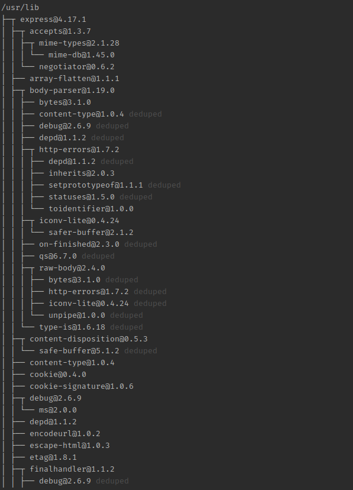

## NPM trong Node.js

## Tìm hiểu về gói tiện ích NPM (Node Package Manager) của NodeJS

NPM là viết tắt của Node Package Manager cung cấp hai chức năng sau:

Tạo các online repository cho node.js mà có thể tìm kiếm được tại địa chỉ search.nodejs.org

Cung cấp các tiện ích để cài đặt gói Node.js, quản lí version và quản lí phụ thuộc của các gói trong Node.js.

NPM được đóng gói cùng với Node.js từ phiên bản v0.6.3. Để kiểm tra phiên bản của NPM, mở cửa sổ dòng lệnh, gõ những lệnh sau và xem kết quả:

``npm --version hoặc npm -v``

Kết quả sẽ hiển thị version hiện tại của NPM

## Cài đặt các NPM Module trong Node.js

Dưới đây là cú pháp đơn giản để cài đặt bất kỳ Node.js Module nào:

``npm install <Module Name>``

Ví dụ: Dưới đây là lệnh để cài đặt một module rất phổ biến trong Node.js, đó là express Module:

``npm install express``

Bây giờ để sử dụng được Module này trong NodeJS, sử dụng cú pháp sau đây:

``var express = require('express');``

## Cài đặt Global và cài đặt local

Mặc định, npm cài đặt bất kì phụ thuộc nào trên máy tính local. Ở đây, module này hướng đến các gói cài đặt trong thư mục node_modules trong thư mục ứng dụng của Node. Gói local này có thể triển khai dựa vào phương thức require(). Ví dụ, khi cài đặt Module "express", thư mục node_modules sẽ được hình  thành trong thư mục hiện tại của source và chứa Module "express".

Lệnh install trên là cài đặt các Module được lưu trên folder Node_modules ở local. Dưới đây sẽ đề cập đến lệnh cài đặt ógi cài đặt toàn cục được lưu trữ trong các file hệ thống. Các phụ thuộc có thể được sử dụng với các hàm **CLI (Command Line Interface)** của node.js nhưng không thể import sử dụng **require()** của ứng dụng Node một cách trực tiếp.

Cài đặt Module express sử dụng cài đặt toàn cục như sau:

``npm install express -g``

Và sử dụng lệnh sau đây để kiểm tra các phiên bản cài đặt toàn cục:

``npm ls -g``

Kết quả sẽ hiển thị như hình minh họa dưới đây:



## Sử dụng gói package.json

Package.json hiển thị trong thư mục root của bất cứ ứng dụng Node nào và được sử dụng để định nghĩa thuộc tính của gói. Bây giờ thử mở một file package.json của gói express bên trong thư mục **node_modules/express/**. Nội dung bên trong file sẽ giống ntn:

```
{
  "_from": "express",
  "_id": "express@4.17.1",
  "_inBundle": false,
  "_integrity": "sha512-mHJ9O79RqluphRrcw2X/GTh3k9tVv8YcoyY4Kkh4WDMUYKRZUq0h1o0w2rrrxBqM7VoeUVqgb27xlEMXTnYt4g==",
  "_location": "/express",
  "_phantomChildren": {},
  "_requested": {
    "type": "tag",
    "registry": true,
    "raw": "express",
    "name": "express",
    "escapedName": "express",
    "rawSpec": "",
    "saveSpec": null,
    "fetchSpec": "latest"
  },
  "_requiredBy": [
    "#USER",
    "/"
  ],
  "_resolved": "https://registry.npmjs.org/express/-/express-4.17.1.tgz",
  "_shasum": "4491fc38605cf51f8629d39c2b5d026f98a4c134",
  "_spec": "express",
  "_where": "/var/www/html/example-nodejs",
  "author": {
    "name": "TJ Holowaychuk",
    "email": "tj@vision-media.ca"
  },
  "bugs": {
    "url": "https://github.com/expressjs/express/issues"
  },
  "bundleDependencies": false,
  "contributors": [
    {
      "name": "Aaron Heckmann",
      "email": "aaron.heckmann+github@gmail.com"
    },
    {
      "name": "Ciaran Jessup",
      "email": "ciaranj@gmail.com"
    },
    {
      "name": "Douglas Christopher Wilson",
      "email": "doug@somethingdoug.com"
    },
    {
      "name": "Guillermo Rauch",
      "email": "rauchg@gmail.com"
    },
    {
      "name": "Jonathan Ong",
      "email": "me@jongleberry.com"
    },
    {
      "name": "Roman Shtylman",
      "email": "shtylman+expressjs@gmail.com"
    },
    {
      "name": "Young Jae Sim",
      "email": "hanul@hanul.me"
    }
  ],
  "dependencies": {
    "accepts": "~1.3.7",
    "array-flatten": "1.1.1",
    "body-parser": "1.19.0",
    "content-disposition": "0.5.3",
    "content-type": "~1.0.4",
    "cookie": "0.4.0",
    "cookie-signature": "1.0.6",
    "debug": "2.6.9",
    "depd": "~1.1.2",
    "encodeurl": "~1.0.2",
    "escape-html": "~1.0.3",
    "etag": "~1.8.1",
    "finalhandler": "~1.1.2",
    "fresh": "0.5.2",
    "merge-descriptors": "1.0.1",
    "methods": "~1.1.2",
    "on-finished": "~2.3.0",
    "parseurl": "~1.3.3",
    "path-to-regexp": "0.1.7",
    "proxy-addr": "~2.0.5",
    "qs": "6.7.0",
    "range-parser": "~1.2.1",
    "safe-buffer": "5.1.2",
    "send": "0.17.1",
    "serve-static": "1.14.1",
    "setprototypeof": "1.1.1",
    "statuses": "~1.5.0",
    "type-is": "~1.6.18",
    "utils-merge": "1.0.1",
    "vary": "~1.1.2"
  },
  "deprecated": false,
  "description": "Fast, unopinionated, minimalist web framework",
  "devDependencies": {
    "after": "0.8.2",
    "connect-redis": "3.4.1",
    "cookie-parser": "~1.4.4",
    "cookie-session": "1.3.3",
    "ejs": "2.6.1",
    "eslint": "2.13.1",
    "express-session": "1.16.1",
    "hbs": "4.0.4",
    "istanbul": "0.4.5",
    "marked": "0.6.2",
    "method-override": "3.0.0",
    "mocha": "5.2.0",
    "morgan": "1.9.1",
    "multiparty": "4.2.1",
    "pbkdf2-password": "1.2.1",
    "should": "13.2.3",
    "supertest": "3.3.0",
    "vhost": "~3.0.2"
  },
  "engines": {
    "node": ">= 0.10.0"
  },
  "files": [
    "LICENSE",
    "History.md",
    "Readme.md",
    "index.js",
    "lib/"
  ],
  "homepage": "http://expressjs.com/",
  "keywords": [
    "express",
    "framework",
    "sinatra",
    "web",
    "rest",
    "restful",
    "router",
    "app",
    "api"
  ],
  "license": "MIT",
  "name": "express",
  "repository": {
    "type": "git",
    "url": "git+https://github.com/expressjs/express.git"
  },
  "scripts": {
    "lint": "eslint .",
    "test": "mocha --require test/support/env --reporter spec --bail --check-leaks test/ test/acceptance/",
    "test-ci": "istanbul cover node_modules/mocha/bin/_mocha --report lcovonly -- --require test/support/env --reporter spec --check-leaks test/ test/acceptance/",
    "test-cov": "istanbul cover node_modules/mocha/bin/_mocha -- --require test/support/env --reporter dot --check-leaks test/ test/acceptance/",
    "test-tap": "mocha --require test/support/env --reporter tap --check-leaks test/ test/acceptance/"
  },
  "version": "4.17.1"
}
```

## Các thuộc tính cơ bản của Package.json

**name** - tên của package

**version** - phiên bản của package

**description** - phần mô tả của package

**homepage** - trang chủ của package

**author** - tác giả của package

**contributors** - tên người đóng góp cho package

**dependencies** - Danh sách các gói phụ thuộc, tự động được cài theo.

**repository** - loại repository và url của package

**main** - điểm vào của package

**keywords** - các từ khóa


## Gỡ cài đặt một module trong Node.js

Sử dụng các dòng lệnh dưới đây để gỡ một Module trong Node.js

``npm unistall <module_name>``


## Cập nhật một Module trong Node.js

Cập nhật gói package.json và thay đổi phiên bản của các ràng buộc mà có thể cập nhật sử dụng lệnh sau đây:

``npm update <module_name>``


## Tìm kiếm một Module trong Node.js

Sử dụng npm, có thể tìm kiếm một Module như sau:

``npm search <module_name>``

## Tạo một Module trong Node.js

Để tạo một Module cho riêng mình, sử dụng lệnh như sau:

``npm init``

Sau khi chạy dòng lệnh, sẽ nhập các thông tin cần thiết, hệ thống sẽ lưu vào file **package.json**. Nội dung sẽ hiển thị như sau:

```
This utility will walk you through creating a package.json file.
It only covers the most common items, and tries to guess sensible defaults.

See `npm help init` for definitive documentation on these fields
and exactly what they do.

Use `npm install <pkg>` afterwards to install a package and
save it as a dependency in the package.json file.

Press ^C at any time to quit.
package name: (example-nodejs) test-module
version: (1.0.0) 1.0.0
description: This is for test
entry point: (index.js) index.js
test command: test-module-command
git repository: (https://github.com/ovpdng124/nodeJS-self-training) 
keywords: testing
author: phatov
license: (ISC) 
About to write to /var/www/html/example-nodejs/package.json:

{
  "name": "test-module",
  "version": "1.0.0",
  "description": "This is for test",
  "main": "index.js",
  "dependencies": {
    "express": "^4.17.1",
    "http": "^0.0.1-security"
  },
  "devDependencies": {},
  "scripts": {
    "test": "test-module-command"
  },
  "repository": {
    "type": "git",
    "url": "git+https://github.com/ovpdng124/nodeJS-self-training.git"
  },
  "keywords": [
    "testing"
  ],
  "author": "phatov",
  "license": "ISC",
  "bugs": {
    "url": "https://github.com/ovpdng124/nodeJS-self-training/issues"
  },
  "homepage": "https://github.com/ovpdng124/nodeJS-self-training#readme"
}


Is this OK? (yes) 
```

Sau khi kết thúc, tại thư mục hiện tại sẽ có 1 file **package.json** được khởi tạo và có nội dung như sau:

```
{
  "name": "test-module",
  "version": "1.0.0",
  "description": "This is for test",
  "main": "index.js",
  "dependencies": {
    "express": "^4.17.1",
    "http": "^0.0.1-security"
  },
  "devDependencies": {},
  "scripts": {
    "test": "test-module-command"
  },
  "repository": {
    "type": "git",
    "url": "git+https://github.com/ovpdng124/nodeJS-self-training.git"
  },
  "keywords": [
    "testing"
  ],
  "author": "phatov",
  "license": "ISC",
  "bugs": {
    "url": "https://github.com/ovpdng124/nodeJS-self-training/issues"
  },
  "homepage": "https://github.com/ovpdng124/nodeJS-self-training#readme"
}
```

Sau khi gói package.json được tạo ra, sử dụng các lệnh dưới đây đăng ký với trang npm bởi sử dụng địa chỉ email hợp lệ.

```
npm adduser

Username: ongvanphat124
Password: 
Email: (this IS public) ongvanphat124@gmail.com

```

Sau đó tiến hành Publish module vừa tạo.

``npm publish``

Nếu mọi thứ thành công tốt đẹp, nó sẽ được publish và thư mục này sẽ được truy cập bởi những người khác sử dụng Module Node.js

### Kết thúc phần nội dung cơ bản về cách sử dụng và làm việc với NPM.
