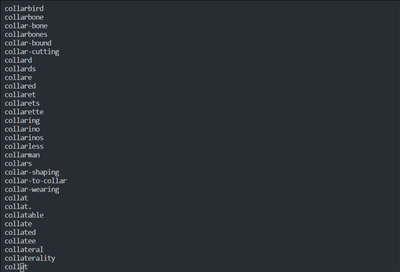

##Streams trong NodeJS là gì ?
Streams là một collections của dữ liệu giống như strings hay arrays, sự khác nhau duy nhất đó là các streams không tồn tại cùng một lúc do đó không cần chiếm nhiều bộ nhớ. Điều khiến streams thực sự mạnh đó là khả năng làm việc khi xử lý với dữ liệu lớn (big data) hay nguồn dữ liệu đến từ nguồn bên ngoài một chút một.

Streams không chỉ dừng lại ở việc xử lý dữ liệu, nó còn đem lại khả năng kết hợp code một cách tuyệt vời.

Streams cho phép bạn đọc dữ liệu từ một nguồn hoặc viết dữ liệu đến một đích đến nào đó. Trong NodeJS, có **4 loại streams** khác nhau:

**Readable:** đây là loại streams chỉ dùng để đọc..

**Writable:** đây là loại streams chỉ dùng để ghi..

**Duplex:** sử dụng cả 2 đọc và ghi.

**Transform:** một loại của Duplex nhưng khác nhau bởi kết quả của đầu ra dựa vào đầu vào.
Mỗi streams đều được cấp một EventEmitter cho phép chúng ta bắt sự kiện theo từng thời điểm cụ thể. Sau đây là một vài sự kiên hay dùng :

**Data:** sự kiện này được kích hoạt khi dữ liệu được đọc
**End:** sự kiện này được kích hoạt khi không còn dữ liệu để đọc
**Error:** sự kiện này được kích hoạt khi xảy ra lỗi.
**Finish:** sự kiện này được kích hoạt khi hoàn thành (dữ liệu đã được đẩy hết về hệ thống cơ sở)

##Object Mode trong Stream

Tất cả các streams được tạo bởi Nodejs API được hoạt động trên các đối tượng kiểu chuỗi và Buffer (hoặc Uint8Array). Tuy nhiên có stream đôi lúc cần làm việc với các kiểu giá trị khác nhau của Javascript (ngoại trừ giá trị null).

Bởi vậy chế độ **object mode** được thêm vào, để sử dụng bạn cần phải chuyển sang chế độ object khi bắt đầu khởi tạo streams. Việc chuyển các streams đã được khởi tạo sang object mode là điểu không an toàn với dữ liệu.


##Thao tác với Stream trong NodeJS

Streams là một chức năng rất mạnh trong Nodejs, tưởng tượng khi bạn làm việc với dữ liệu lớn mà muốn đọc file đó trực tiếp bạn cần phải có một vùng nhớ đủ lớn để lưu trữ nó. Giả sử chúng ta có một file text 10GB mà trong khi đó server của bạn chỉ có 1GB Ram, để đọc file này ngay thì server sẽ không thể thực hiên được vì thiếu bộ nhớ. Streams cho phép chúng ta đọc các dữ liệu lớn bằng cách chia nhỏ dữ liệu ra và đọc giá trị theo từng phần.

##Đọc dữ liệu với Streams

Chúng ta có file dữ liệu dạng text ở file **input.txt** như sau :

``Thực hành với Streams trong NodeJS``

Tạo file readStreams.js và khai báo sử dụng module fs,và sử dụng phương thức **createReadStream()** tham số là đường dẫn file bạn muốn đọc ở đây là **input.txt**

```js
const fs = require("fs");
let data = '';
 
// Đọc file bằng streams bằng phương thức createReadStream
const readerStream = fs.createReadStream('input.txt');
 
// Kiểu mã hóa dùng là UTF8
readerStream.setEncoding('UTF8');
 
// Sự kiện khi đọc data
readerStream.on('data', function(chunk) {
   data += chunk;
});
//Khi kết thúc đọc data và in ra nội dung đã đọc thông qua sự kiện "end"
readerStream.on('end',function(){
   console.log(data)
});
//Khi xảy ra lỗi in ra lỗi thông qua sự kiện "error"
readerStream.on('error', function(err){
   console.log(err.stack);
});
```

Mở terminal và chạy dòng lệnh để xem kết quả:

``node readStreams.js``

##Ghi dữ liệu với Streams

Để ghi một file từ streams chúng ta sử dụng phương thức **createWriteStream()** trong _**module fs**_. Tạo file **writeStreams.js**

```js
const fs = require("fs");
let data = 'Thực hành với Streams trong NodeJS';
 
//Sử dụng phương thức createWriteStream
const writerStream = fs.createWriteStream('output.txt');
 
// Ghi dữ liệu vào file
writerStream.write(data);
 
// Đánh dấu đây là cuối file
writerStream.end();
 
// Bắt sự kiện finish của Streams
writerStream.on('finish', function() {
    console.log("Write done.");
});
// Bắt sự kiện error khi xảy ra lỗi 
writerStream.on('error', function(err){
   console.log(err.stack);
});
```
Mở terminal và chạy dòng lệnh để xem kết quả:

``node writeStreams.js``

Lúc này ta sẽ nhận được 1 file mới có có tên **output.txt** có nội dung

``Thực hành với Streams trong NodeJS``

##Kĩ thuật Piping Stream trong Node.js

Trong Streams ta còn có một khái niệm khác nữa đó là **Piping** (_**đường ống**_) cho phép chúng ta lấy dữ liệu đầu ra từ một stream làm đầu vào trong streams khác. Nó hoạt động như một đường ống giúp chuyển dữ liệu giữa các streams với nhau.

Gộp 2 ví dụ trước, trong ví dụ này chúng ta lấy dữ liệu của file **input.txt** làm dữ liệu đầu vào cho file **output.txt** bằng cách tạo 2 streams và nối với nhau bằng phương thức **pipe** :

```js
const fs = require("fs");
 
// Đọc stream đầu vào là file input bằng phương thức createReadStream()
let readerStream = fs.createReadStream('input.txt');
 
// Ghi stream đầu ra là file input bằng phương thức createWriteStream
let writerStream = fs.createWriteStream('output.txt');
 
//Sử dụng khái niệm về Pipping để dùng dữ liệu đầu ra của readerStream làm giá trị đầu ra của writerStream
readerStream.pipe(writerStream);
```

Như vậy ta thấy, khi vừa lấy nội dung từ file **input.txt** ra thì đổ toàn bộ nội dung đó vào file **output.txt** chỉ thông qua 1 phương thức đơn giản là **pipe()**. Có thể thấy thay vì get data ra từ input rồi nhét data vào output. Pipe giúp ta có 1 đường ống thông suốt đi thẳng từ **input** đến **output** dễ dàng.

##Kỹ thuật Piping Chaining trong Node.js

**Piping Chaining** là kĩ thuật để kết nối đầu ra của các streams lại với nhau, nối đầu ra của streams này với streams khác tạo thành một chuỗi bao gồm nhiều các streams. Nó được sử dụng với cách hoạt động của **piping**. Chúng ta dùng kỹ thuật này để lấy đầu ra của một file, nén nó lại sau đó tiến hành ghi file nén đó ra nhé !

```js
//Sử dụng thư viện fs và thư viện zlib dùng để nén file
const fs = require("fs");
const zlib = require('zlib')
 
//Phương thức có nhiệm vụ nén file
const gzip = zlib.createGzip()
 
//Đọc streams để lấy kết quả đầu ra 
const readStream = fs.createReadStream('input.txt', 'utf8')
 
//Ghi streams ra file mới
const writeStream = fs.createWriteStream('output.txt.gz')
 
//Sử dụng kỹ thuật piping Chaining  
readStream.pipe(gzip).pipe(writeStream)
```

Khi chạy chương trình trên, chương trình sẽ lấy đầu ra của file input.txt để nén file sau đó sẽ tạo ra một file nén mới có tên output.txt.gz. Đây là một kỹ thuật được sử dụng khá nhiều. Có thể hiểu một cách đơn giản là file gốc là ***.txt**, sau khi được nén sẽ tạo ra 1 file mới ở định dạng nén là ***.gz**.

##Ghi file dữ liệu lớn sử dụng Streams

Đối với việc ghi một file lớn một cách thông thường bạn cần phải sử dụng rất nhiều bộ nhớ để xử lý việc ghi file. Nhưng đối với streams việc ghi file dữ liệu lớn không tốn quá nhiều bộ nhớ.

```js
const fs = require('fs');
const file = fs.createWriteStream('bigFile.txt');

for(let i=0; i<= 1e6; i++) {
    file.write('Lorem ipsum dolor sit amet, consectetur adipisicing elit, sed do eiusmod tempor incididunt ut labore et dolore magna aliqua. Ut enim ad minim veniam, quis nostrud exercitation ullamco laboris nisi ut aliquip ex ea commodo consequat. Duis aute irure dolor in reprehenderit in voluptate velit esse cillum dolore eu fugiat nulla pariatur. Excepteur sint occaecat cupidatat non proident, sunt in culpa qui officia deserunt mollit anim id est laborum.\n');
}

file.end();
```

Khi bạn ghi file bằng streams nó sẽ ghi vào file theo từng mảnh (chunk) chứ không ghi theo thành mộc cục to đùng khiến server không tải được mà sập.

##Đọc file dữ liệu lớn sử dụng Streams

Nếu file có dung lượng nặng vào chục GB, nếu bạn đọc theo cách thông thường thì có lẽ server sẽ quá tải, cách thức hoạt động của streams trong đọc file lớn là sẽ chia đọc theo từng phần. Khái niệm **highWaterMark** là kích cỡ của dữ liệu của mỗi **chunk** khi trong streams.

Giả sử dung lượng của **fileBigText.txt** là **40GB**, nếu ta đọc file theo cách thông thường và bị tốn khá là nhiều vùng nhớ :

```js
const fs = require("fs");
fs.readFile("fileBigText.txt","utf8", (err, data) => {
  if (err) {
    console.log(err);
  } else {
    console.log(data);
  }
});
```

Và đây là kết quả sau khi đọc file:


Bây giờ thử đọc file đấy bằng Streams:

```js
const fs = require("fs");
 
// Đọc file bằng streams bằng phương thức createReadStream
const readerStream = fs.createReadStream('fileBigText.txt');
 
// Kiểu mã hóa dùng là UTF8
readerStream.setEncoding('UTF8');
 
// Sự kiện khi đọc data
readerStream.on('data', function(chunk) {
   console.log(chunk)
});
```

Kết quả sau khi đọc file bằng Streams:



Nhìn kết quả có thể dễ dàng nhận thấy streams đọc file liên tục từng phần, đọc đến đâu hiển thị đến đó, trong lúc chờ đợi đọc hết thì người dùng vẫn có thể xem trước các nội dung đã đọc được trước đó thay vì chờ hẳn 1 cục 40GB xử lý xong mới trả về.

###Kết thúc phần giới thiệu về cách sử dụng và lợi ích của Streams trong NodeJS.
