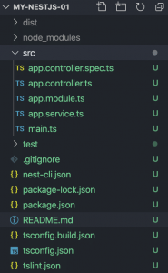

# NestJS là gì và cách thiết lập để có thể chạy được một dự án sử dụng NestJS.

## NestJS là gì?

NestJS là một Nodejs framework hiện đại dùng để xây dựng các ứng dụng trên server (ví dụ như tạo REST API chẳng hạn). Với ưu điểm nổi bật là tính hiệu quả, đáng tin cậy và dễ mở rộng, hỗ trợ Typescript. Đặc biệt là lớp bên dưới sử dụng ExpressJS nên nó kế thừa toàn bộ sức mạnh của framework phổ biến này.

Có thể hiểu đơn giản là NestJS là một dự án mà tác giả muốn wapper lại mã nguồn, tối ưu và sắp xếp mã nguồn dựa trên NodeJS và ExpressJS. Nhờ đó mà mã nguồn dự án gọn gàng hơn, dễ bảo trì và tốc độ phát triển, xây dựng ứng dụng cũng nhanh hơn.

## Cài đặt NestJS

Trước khi có thể sử dụng NestJS để xây dựng ứng dụng, cần phải cài đặt sẵn công cụ Nest CLI (Command Line Interface). Vẫn cách thức truyền thống, đó là sử dụng NPM để cài đặt. (Ngoài ra cũng có thể dùng YARN)

```shell
npm i -g @nestjs/cli
```

Tất nhiên, do NestJS xây dựng trên NodeJS nên trên máy tính phải cài đặt sẵn Nodejs và NPM.

Một khi Nest CLI đã cài đặt xong, chúng ta có thể sử dụng lệnh để tạo dự án NestJS:

``
nest new my-nestjs-01
``

Lệnh này sẽ tự động tạo một thư mục dự án với các file cần thiết để dự án có thể bắt đầu.

## Cấu trúc dự án    

Cấu trúc ban đầu mà bạn tạo bằng lệnh Nest CLI sẽ như hình bên dưới đây:



Thư mục quan trọng nhất của dự án là src. Thư mục này sẽ chứa toàn bộ mã nguồn của dự án (mã nguồn có thể viết bằng typescript). Khi xây dựng ứng dụng, thư mục này sẽ là nơi làm việc thường xuyên nhất.

Bên trong thư mục src, các file sau đây sẽ được tạo sẵn:

- `main.ts`: là file sẽ khởi tạo các đối tượng để chạy ứng dụng.
- `app.module.ts`: Đây là module gốc của ứng dụng. Nó có trách nhiệm đóng gói tất cả mọi thứ của dự án.
- `app.controller.ts`: Đây là controller gốc của route gốc. Trong trường hợp mặc định là nó xử lý cho route `homepage`: http://localhost:3000
- `app.service.ts`: Chứa các hàm xử lý business logic.
- `app.controller.spec.ts`: Là file dùng để test controller. Các file khác có *.spec.ts đều là file Unit Test cho các file có cùng tên.

Như vậy, nhìn tổng quan, mã nguồn ứng dụng NestJS được chia thành 3 phần chính:

- Modules
- Controllers
- Services

Không như các framework của các ngôn ngữ khác, ko còn nhìn thấy `MVC` quen thuộc nữa. NestJS dùng `Modules Pattern` để biểu diễn cấu trúc của bộ source.

Về Modules Pattern có ưu nhược điểm ntn sẽ được đề cập sau, trước mắt xoáy sâu vào xem bên trong các file được tạo sẵn này có những gì và hoạt động ntn.

## NestJS hoạt động như thế nào?

Đầu tiên là `main.ts`, mặc định khi tạo dự án bằng nest CLI, đoạn mã sẽ như sau:

```typescript
import { Module } from '@nestjs/common';
import { AppController } from './app.controller';
import { AppService } from './app.service';

@Module({
  imports: [],
  controllers: [AppController],
  providers: [AppService],
})
export class AppModule {}
```

Ở đây ta sẽ thấy NestJS sử dụng `decorator` để chỉ định class `AppModule` là một Module. Nếu đã từng sử dụng Spring Framework trong Java sẽ ko xa lạ với `decorator` này. Và về `decorator` là gì thì sẽ được đề cập sau, mục tiêu trước tiên là sẽ làm cho 1 dự án NestJS có thể chạy được trước đã.

Để khai báo lớp AppModule theo kiểu module, sử dụng decorator `@Module()`. Trong `decorator` này, truyền option có 3 thuộc tính sau:

- imports
- controllers
- providers

Tất cả các `Controller` thuộc một module sẽ phải khai báo trong thuộc tính controllers ở trên.

Trong mã mặc định được tạo bởi `Nest CLI`, `AppModule` có duy nhất một controller: `AppController`.

Vậy cấu trúc của `Controller` trong NestJS sẽ ntn:

```typescript
import { Controller, Get } from '@nestjs/common';
import { AppService } from './app.service';

@Controller()
export class AppController {
  constructor(private readonly appService: AppService) {}
  
  @Get()
  getHello(): string {
    return this.appService.getHello();
  }
}
```

Ta sẽ định nghĩa route ở bên trong `Controller` thông qua các `decorator` như `GET` `POST` `PUT` `DELETE`. 

Ở trong `Controller` này chỉ định nghĩa duy nhất một `GET` route, sau này hoàn toàn có thể bổ sung thêm các route khác như `POST`, `PUT`, `DELETE`.

Trong ví dụ `Controller` này, chúng ta có gọi tới một hàm của `service`: `appService.getHello();`

Trước tiên, để gọi được `service` ta cần phải khai báo appService bên trong `Controller`. Khai báo như thế nào thì bên trong file `Controller` đã thể hiện rõ, đó là sử dụng `DI`, và bên trên là cách để `inject` một class.

Còn đây là bên trong nội dung của `app.service.ts`:

```typescript
import { Injectable } from '@nestjs/common';

@Injectable()
export class AppService {
  getHello(): string {
    return 'Hello World!';
  }
}
```

Để có thể `inject` class `AppService` bên `Controller`, cần phải chỉ định class `AppService` là một dạng có thể `inject` thông qua `decorator @njectable()`.

## Chạy ứng dụng NestJS

Để chạy được ứng dụng, chạy lệnh sau:

```shell
npm run start
```

hoặc

```shell
yarn start
```

Sẽ mất một lúc để chương trình build môi trường. Không như PHP, NodeJS sau mỗi lần thay đổi code cần sẽ phải build lại môi trường. Sau đó vào browser chạy với đường dẫn `http://localhost:3000` sẽ nhận được kết quả.

Như câu lệnh ở trên, sẽ rất bất tiện nếu như mỗi lần sửa 1 vài đoạn code ta lại phải chạy lại câu lệnh trên. Để giải quyết vấn đề đó, chỉ cần thêm 1 tí cho câu lệnh là xong:

```shell
npm run start:dev
```

hoặc

```shell
yarn start:dev
```

Với câu lệnh trên, khi thay đổi 1 dòng code nào, chương trình sẽ tự động build lại server và chạy lại mà không cần phải gõ lại đoạn lệnh trên. Chỉ việc refresh lại browser là có thể apply đoạn code mới rồi.

### Như vậy là có thể chạy được một chương trình NodeJS đơn giản bằng cách áp dụng NestJS Framework. Ở phần sau sẽ nói điểm chủ chốt của NestJS, chính là xử lí các API
