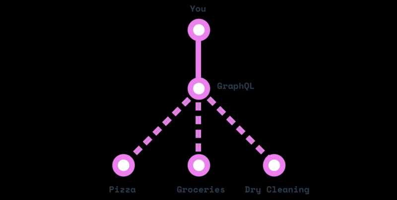

# GraphQL là gì?

GraphQL là một cú pháp mô tả cách yêu cầu lấy dữ liệu, và thường được dùng để load data từ một server cho client.

> _GraphQL bao gồm 3 điểm đặc trưng bao gồm cho phép client xác định chính xác những gì dữ liệu họ cần, làm cho việc tổng hợp dữ liệu từ nhiều nguồn dễ dàng hơn và nó sử dụng một type system để mô tả dữ liệu._ 


# Vấn đề

GraphQL bắt đầu từ ông lớn Facebook, thế nhưng ngay cả những app đơn giản đôi khi vẫn gặp phải một số vấn đề do sự hạn chế của REST APIs.

> _Ví dụ bạn muốn hiển thị một list posts, và ở dưới mỗi post là một list like, bao gồm cả tên người dùng và avatar. Cách giải quyết đơn giản là thay đổi API của ``posts`` để nó bao gồm **‘like’ array** chứa thông tin về người dùng._


Thế nhưng khi làm như vậy cho các app mobile thì bạn sẽ phát hiện ra tốc độ của chúng chạy quá chậm. Vì thế mà giờ đây bạn sẽ cần tới 2 endpoints, một với ``likes`` và một ko chứa ``like``.

Giờ thì còn có thêm một vấn đề khác xuất hiện: trong khi ``posts`` được lưu trữ trong một MySQL database thì ``likes`` lại được lưu tại **Redis** store!

> _Mở rộng vấn đề trên ra với việc Facebook phải quản lí vô số data source và API clients thì cũng là điều dễ hiểu khi REST APIs bị đánh giá là cũ kĩ bởi những hạn chế của nó._


# Giải pháp

Giải pháp mà Facebook đưa ra đến từ một ý tưởng rất đơn giản: Thay vì có đến hàng tá “endpoint” ngu ngốc, sao lại không dùng chỉ một “endpoint” thông minh với khả năng tiếp thu những Query phức tạp rồi đưa ra ``output data`` với loại ``type`` tùy theo yêu cầu của client.

Thế tế mà nói, GraphQL như là một ``layer`` nằm giữa ``client`` và ``data source``, sau khi nhận yêu cầu của client thì nó sẽ kiếm những thông tin cần từ các data source và đưa lại cho client theo format họ muốn.

**REST** model cũ giống y như việc bạn đặt cái bánh Pizza, rồi gọi ship hàng online và kêu bên tiệm giặt ủi đem đồ đến cho bạn. Tất cả diễn ra với 3 cuộc gọi và 3 cửa hàng.


GraphQL mặt khác lại giống như là thư kí riêng của bạn vậy: Sau khi bạn đưa địa chỉ của 3 cửa hàng và nói yêu cầu của bạn thì GraphQL sẽ làm hết mọi chuyện còn lại trong khi bạn chỉ việc chờ chúng được chuyển đến cho mình.



GraphQL API được tạo ra từ 3 phần chính: **schema**, **queries**, và **resolvers**

## Queries

Như ở ví dụ trên, những yêu cầu bạn đặt ra cho thư kí của mình - GraphQL, khi ``query`` nó sẽ giống như thế này:

```text
query {
  stuff
}
```
Chúng ta khai báo một ``query`` mới sử dụng keyword ``query`` , và đặt tên cho field đó là **stuff**. Điều thú vị của GraphQL query là có support các **nested fields**. Thế nên chúng ta có thể đi sâu vào hơn:

```text
query {
  stuff {
    eggs
    shirt
    pizza
  }
}
```

Như bạn thấy, client khi đưa ra những yêu cầu và tạo ra query sẽ không cần lo data đến từ source nào. Chỉ việc hỏi và GraphQL server sẽ lo hết mọi thứ khác.

Cũng đáng lưu ý là việc các query field còn có khả năng chỉ đến các array

```text
query {
  posts { # this is an array
    title
    body
    author { # we can go deeper!
      name
      avatarUrl
      profileUrl
    }
  }
}
```

Query field còn support cả **argument**. Nếu bạn muốn đưa ra một ``post`` riêng, thì chỉ cần thêm ``id`` argument cho post field.

```text
query {
  post(id: "123foo"){
    title
    body
    author{
      name
      avatarUrl
      profileUrl
    }
  }
}
```

Cuối cùng, nếu bạn còn muốn ``id`` argument đó đặc biệt hơn, bạn có thể tạo ra một ``variable`` và tái sử dụng chúng bên trong query (nhớ là ta phải đặt tên cái query đó luôn)

```text
query getMyPost($id: String) {
  post(id: $id){
    title
    body
    author{
      name
      avatarUrl
      profileUrl
    }
  }
}
```

Một cách thực hành khá tốt là sử dụng **GitHub’s GraphQLAPI Explorer**. Hãy thử query sau:

```text
query {
  repository(owner: "graphql", name: "graphql-js"){
    name
    description
  }
}
```


Bạn sẽ thấy rằng việc bạn thử đặt tên cho một field ở bên dưới description, IDE sẽ tự động gợi ý cho bạn những tên field có sẵn hoặc tự tạo bởi chính GraphQLAPI ! Khá hay đúng không?


## Resolvers

Cho dù có là thư ký giỏi nhất quả đất cũng không thể đi lấy quần áo cho bạn nếu không có địa chỉ của tiệm giặt đồ.

Tương tự vậy, GraphQLserver sẽ không biết phải làm gì với query bạn đưa ra trừ khi nó biết được ``resolver``.

> _Resolver nói cho GraphQL biết nơi và cách thức để lấy data cần thiết cho field của query mà bạn yêu cầu. Sau đây là một `resolver` cho field `post` ở trên (sử dụng Apollo’s GraphQL-Tools schema generator)_

```text
Query: {
  post(root, args) {
    return Posts.find({ id: args.id });
  }
}
```

Ta đặt resolver ngay trong Query bởi vì ta muốn query cho ``post`` ngay lập tức. Tuy nhiên, bạn vẫn có thể dùng **resolver** trong ``sub-field``, như ``author`` field của ``post``

```text
Query: {
  post(root, args) {
    return Posts.find({ id: args.id });
  }
},
Post: {
  author(post) {
    return Users.find({ id: post.authorId})
  }
}
```

Nhớ lưu ý rằng ``resolver`` sẽ không bị giới hạn bởi trong số lượng thông tin được đưa về nên bạn sẽ muốn thêm ``commentsCount`` cho ``Post`` type:

```text
Post: {
  author(post) {
    return Users.find({ id: post.authorId})
  },
  commentsCount(post) {
    return Comments.find({ postId: post.id}).count() 
  }
}

```

Điều quan trong bạn cần hiểu ở đây là với GraphQL, **API schema của bạn và database schema sẽ bị chia ra riêng biệt**. Nói cách khác, có thể sẽ không có bất kì ``author`` và ``commentsCount`` nào trong database của mình nhưng ta vẫn có thể “mô phỏng” chúng nhờ vào ``resolver``.

Bạn có thể viết bất kì code gì trong ``resolver``, vì thế mà bạn có thể dùng chúng để sửa đổi nội dung của database, vốn còn được gọi là **mutation resolver**.

## Schema

Có thể hiểu đơn giản là một bản thiết kế cấu trúc cho những ``query`` phức tạp mà chúng ta cần phải tuân theo đúng format được dựng từ trước thông qua **Resolvers**. Khi chúng ta thiết kế ra một **Resolver** thì đồng nghĩa chúng ta sẽ update thêm vào **Schema** một cấu trúc mới và những gì chúng ta cần ``input`` và ``output`` sẽ được gói gọn trong **Schema**.

Thông qua **Schema** chúng ta sẽ biết được API chúng ta cần gọi sẽ cần những điều kiện gì và API đó sẽ đáp ứng dữ liệu trả về cho chúng ta gồm có những gì.

### Bài này chỉ giới thiệu sơ lược về GraphQL để có thể hiểu sơ bộ về cấu trúc và những thành phần cấu tạo. Để thể hiểu sâu hơn về cách thức hoạt động và hình thành một API hoàn chỉnh cần phải được ví dụ rõ hơn. Bài sau về GraphQL sẽ được giới thiệu và hướng dẫn trực tiếp thông qua các bài Seminar/Sharing.
