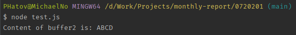
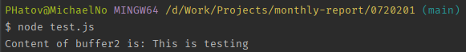

# **Buffer trong Node.js**

Javascript thuần được mã hóa Unicode, nhưng đối với các dữ liệu nhị phân thì không thật sự tốt. Khi làm việc với các luồng TCP hoặc file dữ liệu, cần thiết phải xử lý các luồng dữ liệu bát phân. Node.js cung cấp các lớp Buffer cho phép lưu trữ các dữ liệu thô như một mảng các số nguyên tương ứng với phần cấp phát bộ nhớ thô bên ngoài V8 heap.

**Lớp Buffer trong Node.js** là các lớp toàn cục và có thể được truy cập trong ứng dụng mà không cần khai báo các Module Buffer bởi phương thức `require()` như các Module khác.

### Tạo các Buffer trong Node.js

Buffer trong Node.js có thể được xây dựng theo nhiều cách khác nhau.

**Cách 1**

Cú pháp cho việc tạo một Buffer cỡ 10:

```javascript
var buf = new Buffer(10);
```

**Cách 2**

Cú pháp tạo một Buffer từ một mảng cho trước:

```javascript
var buf = new Buffer([10, 20, 30, 40, 50]);
```

**Cách 3**

Cú pháp tạo một Buffer từ một chuỗi cho trước và với kiểu mã hóa tùy ý:

```javascript
var buf = new Buffer("Buffer in NodeJS", "utf-8");
```

Mặc dù "utf8" là cách mã hóa mặc định nhưng bạn có thể sử dụng các cách mã hóa khác như "ascii", "utf8","base64", …

### Ghi dữ liệu vào Buffer trong Node.js

**Cú pháp**

Cú pháp để ghi một Buffer trong Node.js là:

```typescript
buf.write(string, offset, lengt, encoding)
```

**Chi tiết về tham số**

- **string**: Đây là một dữ liệu dạng chuỗi được ghi tới buffer.

- **offset**: Đây là chỉ mục để buffer bắt đầu ghi tại đó. Giá trị mặc định là số 0.

- **length**: Số lượng các byte được ghi. Mặc định là buffer.length.

- **encoding**: Mã hóa được sử dụng. "utf8" là mã hóa mặc định.

**Giá trị trả về**

Phương thức sẽ trả về số lượng các byte được ghi. Nếu bộ nhớ trong buffer là không đủ để đáp ứng cho toàn bộ chuỗi, nó sẽ ghi một phần của chuỗi đó.

**Ví dụ cách ghi dữ liệu vào Buffer trong Node.js**

Ở ví dụ này, mình sử dụng phương thức `write()` nhận tham số là dữ liệu dạng chuỗi để ghi dữ liệu đó tới Buffer.

```javascript
buf = new Buffer(256);
len = buf.write("This is testing parameter");
console.log("Total of Byte: " + len);
```

Khi chương trình trên được thực thi sẽ cho kết quả:


### Đọc dữ liệu từ Buffer trong Node.js

**Cú pháp**

Cú pháp để đọc dữ liệu từ Buffer trong Node.js như sau:

```javascript
buf.toString(encoding, start, end)
```

**Chi tiết về tham số**

- **encoding**: Là mã hóa để sử dụng. Mã hóa mặc định là 'utf8'.

- **start**: Chỉ mục để bắt đầu hoạt động đọc, giá trị mặc định là 0.

- **end**: Chỉ mục để kết thúc hoạt động đọc, giá trị mặc định là độ dài của Buffer.

**Giá trị trả về**

Phương thức này giải mã và trả về một chuỗi từ dữ liệu đã được mã hóa trong Buffer bởi sử dụng bộ mã hóa cụ thể.

**Ví dụ cách đọc dữ liệu từ Buffer trong Node.js**

```javascript
buf = new Buffer(26);
for (var i = 0 ; i < 26 ; i++) {
  buf[i] = i + 97;
}

// Result: abcdefghijklmnopqrstuvwxyz
console.log(buf.toString('ascii'));

// Result: abcde
console.log(buf.toString('ascii', 0, 5));

// Result: abcde
console.log(buf.toString('utf8', 0, 5));

// Using default 'utf8', Result will be: abcde
console.log(buf.toString(undefined, 0, 5));

console.log('Done!')
```

Khi chương trình trên được thực thi sẽ cho kết quả:


### Chuyển đổi Buffer thành JSON trong Node.js

**Cú pháp**

Để chuyển đổi một Buffer trong Node.js thành đối tượng JSON, bạn sử dụng phương thức `toJSON()` có cú pháp như sau:

```javascript
buf.toJSON()
```

**Giá trị trả về**

Phương thức này trả về một biểu diễn JSON cho đối tượng Buffer đã cho.

**Ví dụ cách chuyển đổi Buffer thành JSON**

```javascript
var buf = new Buffer('This is testing parameter');
var json = buf.toJSON(buf);

console.log(json);
```

Khi chương trình trên được thực thi sẽ cho kết quả:


### Ghép nối các Buffer trong Node.js

**Cú pháp**

Để nối ghép hai hoặc nhiều Buffer thành một Buffer trong Node.js, bạn sử dụng phương thức `concat()` như sau:

```javascript
Buffer.concat(list, totalLength)
```

**Chi tiết về tham số**

- **list** - Xác định một mảng các Buffer được sử dụng để ghép nối thành một Buffer.

- **totalLength** - Là tổng độ dài của các Buffer sau khi đã được ghép nối.

**Giá trị trả về**

Phương thức này trả về một Buffer mới.

**Ví dụ cách ghép nối các Buffer**

```javascript
var buffer1 = new Buffer('This is testing parametter');
var buffer2 = new Buffer(' - Hello World!');
var buffer3 = Buffer.concat([buffer1, buffer2]);

console.log("Content of buffer3 is: " + buffer3.toString());
```

Khi chương trình trên được thực thi sẽ cho kết quả:


### So sánh các Buffer trong Node.js

**Cú pháp**

Để so sánh hai Buffer trong Node.js, bạn sử dụng phương thức `compare()` như sau:

```javascript
buf.compare(otherBuffer);
```

**Chi tiết về tham số**

- **otherBuffer**: Một Buffer khác để được so sánh với Buffer có tên là `buf`.

**Giá trị trả về**

Trả về một giá trị dạng số thể hiện Buffer này là đứng trước, sau hay cùng thứ tự với Buffer kia.

**Ví dụ minh họa cách so sánh hai Buffer trong Node.js**

```javascript
var buffer1 = new Buffer('ABC');
var buffer2 = new Buffer('ABCD');
var result = buffer1.compare(buffer2);

if(result < 0) {
   console.log(buffer1 +" Before " + buffer2);
}else if(result == 0){
   console.log(buffer1 +" Equal " + buffer2);
}else {
   console.log(buffer1 +" After " + buffer2);
}
```

Khi chương trình trên được thực thi sẽ cho kết quả:


### Sao chép Buffer trong Node.js

**Cú pháp**

Để sao chép Buffer trong Node.js, bạn sử dụng phương thức `copy()` như sau:

```javascript
buf.copy(targetBuffer, targetStart, sourceStart, sourceEnd)
```

**Chi tiết về tham số**

- **targetBuffer**: Đối tượng Buffer, đây là nơi Buffer sẽ được sao chép.

- **targetStart**: Dạng số, mặc định là 0.

- **sourceStart**: Dạng số, mặc định là 0.

- **sourceEnd**: Dạng số, mặc định là độ dài của buffer.

**Giá trị trả về**

Phương thức `copy()` này không trả về bất kỳ giá trị nào.

**Ví dụ minh họa cách sao chép Buffer**

```javascript
var buffer1 = new Buffer('ABCD');
var buffer2 = new Buffer(4);

// Copy a buffer
buffer1.copy(buffer2);

console.log("Content of buffer2 is: " + buffer2.toString());
```

Khi chương trình trên được thực thi sẽ cho kết quả:



### Chia nhỏ Buffer trong Node.js

**Cú pháp**

Để lập một Buffer con của một Buffer trong Node.js, bạn sử dụng phương thức `slice()` như sau:

```javascript
buf.slice(start, end)
```

**Chi tiết về tham số**

- **start**: Dạng số, giá trị mặc định là 0.

- **end**: Dạng số, giá trị mặc định là buffer.length

**Giá trị trả về**

Trả về một Buffer mới mà tham chiếu tới cùng vùng bộ nhớ như Buffer cũ.

**Ví dụ minh họa cách chia nhỏ Buffer**

```javascript
var buffer1 = new Buffer('This is testing parameter');
var buffer2 = buffer1.slice(0, 15);

console.log("Content of buffer2 is: " + buffer2.toString());
```

Khi chương trình trên được thực thi sẽ cho kết quả:



Ngoài ra còn nhiều phương thức khác của Buffer rất tiện dụng mà không được dẫn chứng hết. 

### Kết thúc bài giới thiệu về công dụng Buffer trong NodeJS.