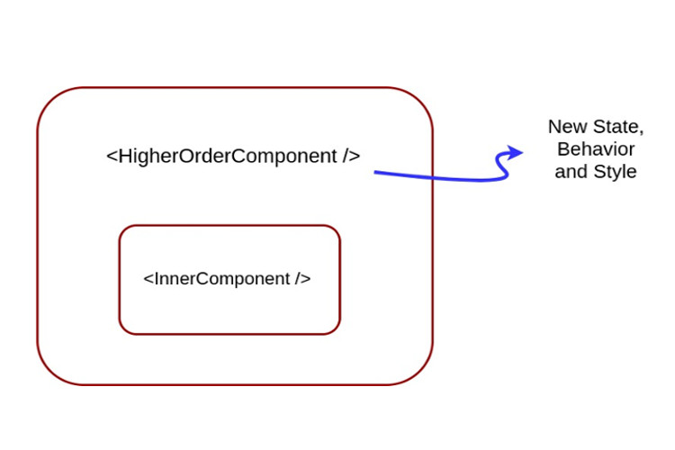
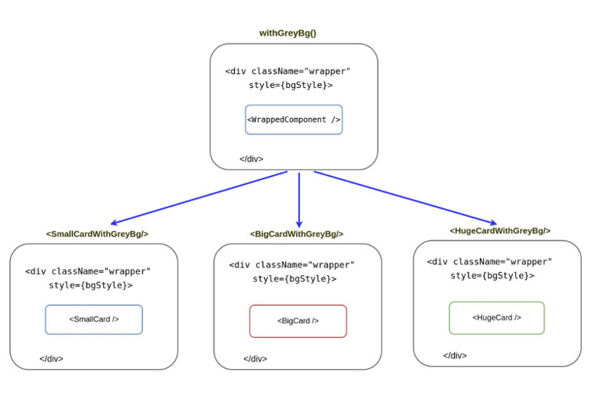

## Giới thiệu Higher-Order Component

### HOC là gì?

Higher order component (HOC) là một hàm nhận đối số là 1 component và trả về 1 component mới.

Nói đơn giản thì HOC là 1 function nhận vào 1 component như 1 argument và trả về một phiên bản mở rộng của component đó

### HOC sử dụng trong trường hợp nào?

Chúng ta sử dụng nó khi:
 - Muốn thêm hay thay đổi các prop của 1 component
 - Xử lý các ngoại lệ (keyboard, style,...) mà bản thân component không cần thiết phải xử lý trong chính nó
 - Tái sử dụng code, maintain
 
### Currying function

Để đọc hiểu bài này dĩ nhiên cần nắm cơ bản ES6, hiểu Currying function là thế nào.

Currying function là cách viết tách một function nhận nhiều `arguments`, tách function đó ra thành nhiều function con, mỗi function nhận 1 argument. Ví dụ:

```javascript
// một hàm sum thông thường
const sum = (a, b) => a + b;

// cà-ri function
const curriedSum = function(a) {
    return function(b) {
        return (a + b)
    }
}
```

### Higher-Order Function

Trước đây trong javascript vẫn thường viết kiểu truyền một `callback function` (vì trong javascript function được xem là object nên làm được chuyện này), hay 1 function trả về một kết quả trả về của function khác.

```javascript
const calculator = (inputFunction) => (...args) => {
    const resultValue = inputFunction(...args);
    console.log(resultValue);
    return resultValue;
}

const add = (...all) => {
    return all.reduce((a, b) => a + b, 0);
}

const multiply = (...all) => {
    return all.reduce((a,b) => a*b, 1)
}
```

Ta có thể sử dụng hàm `calculator` như sau

```javascript
calculator(mutiply)(2,4);
// => 8

calculator(add)(3,6,9,12,15,18);
// => 63
```

Các hàm như `add`, `multiply` chấp nhận số lượng input không giới hạn, hàm `calculator` sử dụng như một `container`, làm cha thiên hạ, sai hết đứa này tới đưa khác làm việc, **extend** thêm một số xử lý trước khi gọi hàm `add`, `multiply`

### Higher-Order Component (HOC)

Một `higher-order component` là một một function nhận vào một `component` như một `argument` và trả về “phiên bản mở rộng” của `component` đó.

```javascript
(InputComponent) => {
    return ExtendedComponent
}

// hoặc
InputComponent => ExtendedComponent
```

`ExtendedComponent` là một **component container**, nó trả về `InputComponent` với một số extend



```typescript
const withGreyBg = WrappedComponent => class NewComponent extends Component {
    constructor() {
        super();
        this.bgStyle = { backgroundColor: 'grey' }
    }

    render() {
        const bgStyle = this.bgStyle

        return (
           `<div className='wrapper' style={bgStyle}>
                <WrappedComponent {...this.props} />
            </div>`
        )
    }
}

const SmallCardWithGreyBg = withGreyBg(SmallCard);
const BigCardWithGreyBg = withGreyBg(BigCard);
const HugeCardWithGreyBg = withGreyBg(HugeCard);

class CardsDemo extends Component {
    render() {
        `<SmallCardWithGreyBg {...this.props} />
        <BigCardWithGreyBg {...this.props} />
        <HugeCardWithGreyBg {...this.props />`
    }
}
```




### Nhược điểm của HOC

Mặc dù sử dụng HOC sẽ mang lại nhiều lợi ích nhưng nếu sử dụng tràn lan, không đúng cách có thể gây ra một số vấn đề sau:

 - Dễ rối: HOC cho thấy nó ko minh bạch trong việc đã **extend** những phần nào cho thằng con
 - Trùng lặp tên props dẫn tới việc props bị ghi đè.
 - Trong một số trường hợp sẽ làm ảnh hưởng đến hiệu năng.
 - Nếu một `component` được bọc trong nhiều `HOC` cùng lúc, có thể sẽ vô tình dẫm đạp qua lại
 - `Debug` cũng không dễ dàng vì đang sử dụng `arrow function`.