## Giới thiệu Higher-Order Component

### Strapi là gì?

Strapi là một CMS Headless mã nguồn mở cho phép các nhà phát triển tự do lựa chọn các công cụ và khuôn khổ yêu thích của họ. Với tất cả các plugin và tính năng, Strapi cung cấp cho các nhà phát triển khả năng tùy chỉnh và khả năng mở rộng. Strapi cũng rất thân thiện với nhà phát triển bằng cách cung cấp một API có thể dễ dàng truy cập thông qua điểm cuối REST hoặc GraphQL.

### Cài đặt Strapi

**Lưu ý:** Để sử dụng Strapi, yêu cầu NodeJS phải là V12 trở lên, và đặt biệt version Node phải là số chẵn. Các version NodeJS mang số lẻ (V13 hoặc V15...) sẽ không bao giờ được hỗ trợ.
 - Còn NPM thì V6 hoặc bất kỳ phiên bản nào đi kèm với các bản LTS Node
 - Về OS thì Win10, Ubuntu >= 18.04, còn riêng thằng macOS thì Mojave hoặc mới hơn thì được, ko hỗ trợ ARM. Ở đây chỉ đề cập đến những OS thường dùng, nếu qtâm những OS khác hãy tham khảo thêm ở trang chủ nhé!

Bắt đầu tạo một dự án mới, chạy lệnh command:

```
npx create-strapi-app my-project --quickstart
```

 - **my-project** có thể thay đổi, đây là tên thư mục chứa source.

Rồi, chỉ việc chờ mọi thiết lập của Strapi chạy xong, nó sẽ tự động build and run luôn. Việc tiếp theo là truy cập vào localhost.

Hệ thống sẽ build mặc định trên port 1337

```
http://localhost:1337/admin
```

Khi vào link này, đầu tiên sẽ có 1 form đăng ký cho admin.

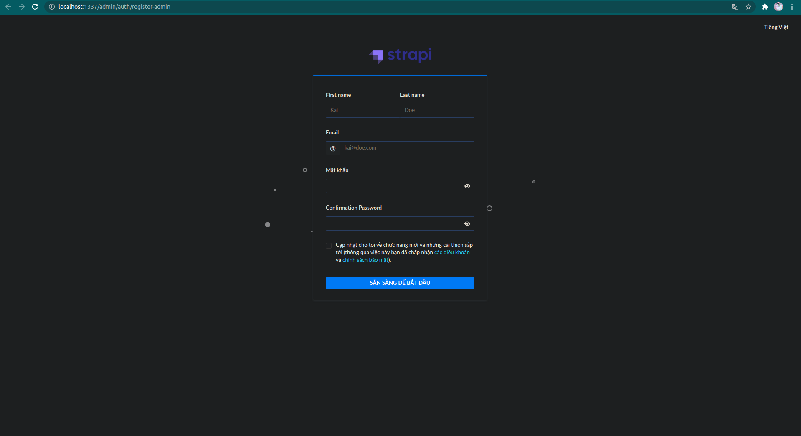

Strapi có hỗ trợ cả ngôn ngữ Tiếng Việt, có thể setup ngôn ngữ khác ở góc trên bên phải màn hình.

Sau khi đăng ký xong, giao diện chính của Strapi sẽ như thế này

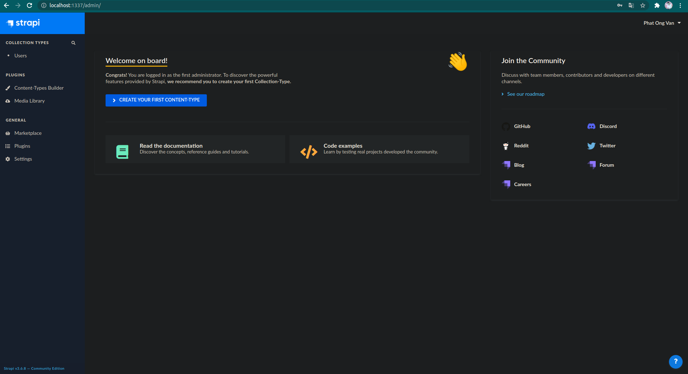

Lúc này, chúng ta có thể tạo ra API một cách dễ dàng với nhưng thao tác đơn giản mà không cần phải viết code rườm rà phức tạp.

### Data Structure

`Content-Types Builder plugin` sẽ giúp chúng ta tạo được cấu trúc cho dữ liệu.

Ở đây chúng ta sẽ tạo 2 bảng dữ liệu đơn giản là: `Restaurant` và `Category`. Trong Strapi, mục `Content-Type Builder` về bản chất nó sẽ giống như tạo 1 class Entity để migration lên DB vậy đó. Và `Collection Type` nó giống như là nơi quản lý các bảng dữ liệu trên DB vậy.

Tạo `Restaurant` Collection Type

 1. Vào mục Plugins -> Content-Types Builder trong sidebar
 2. Bấm chọn **Create new collection type**
 3. Nhập `restaurant` ở khu vực **Display name** và nhấn **Continue**
 
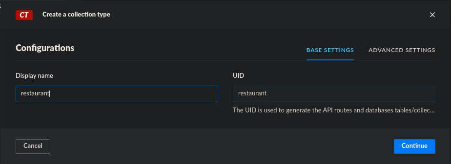

Vậy là đã tạo xong tên của 1 `Collection Type`, tiếp theo sẽ tạo các thuộc tính cho nó. Ở đây chúng ta có rất nhiều kiểu dữ liệu, chỉ cần lựa chọn những kiểu thích hợp là được.

Ví dụ: Ở đây sẽ tạo tiếp 2 thuộc tính `Name` và `Description`. Vậy chúng ta chỉ cần chọn kiểu **Text** cho `Name` và kiểu **Rich Text** cho `Description`

 4. Bấm vào kiểu Text
 5. Nhập `name` vào ô **Name**

Bây giờ chúng ta muốn thuộc tính `name` này là **NOT NULL**, và **UNIQUE** thì chỉ cần làm tiếp các bước sau đây.

 6. Bấm vào Tab `Advanced Settings`
 7. Tích vào mục `Required Field` và `Unique Field`

Như vậy là đã thiết lập xong một thuộc tính trong `restaurant`. Lúc này khoan hãy bấm `Finish`, chúng ta làm tương tự với thuộc tính `Description`

 8. Bấm vào `Add another field`
 9. Chọn `Rich Text`
 10. Nhấn Finish

Cuối cùng, bấm nút `Save` ở góc phải bên trên để tiến hành lưu lại mọi thứ.

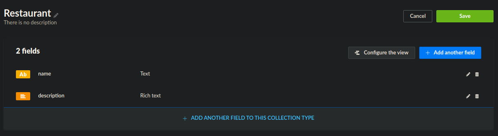

Tiếp theo, ở bảng dữ liệu `Category` cũng tương tự, lần lượt các bước trên, tạo tên của Collection Type và thuộc tính `name`

 1. Làm theo bước 1 đến bước 5 ở trên, đặt tên Collection Type là `category`
 2. Nhấp vào kiểu `Relation`
 3. Ở phía bên phải, bấm vào Dropdown xổ xuống và chọn `Restaurant`
 4. Chọn quan hệ Many-Many cho 2 bảng dữ liệu rồi bấm `Finish`

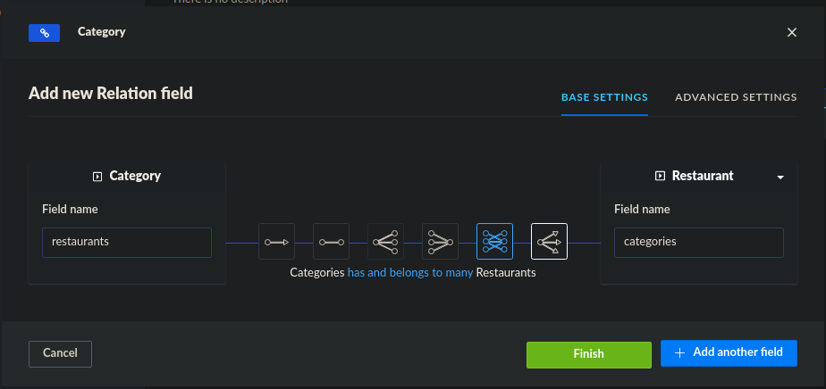

Bấm `Save` để lưu lại.

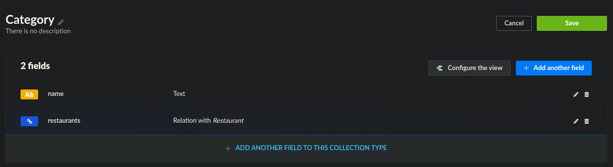

Như vậy là đã tạo thành công 2 bảng dữ liệu đơn giản, tiếp theo sẽ tiến hành thêm dữ liệu vào và lưu trữ nó.

### CRUD

Với Strapi, là một CMS mạnh mẽ nên sẽ hỗ trợ về mọi mặt trong những thao tác cơ bản nhất như CRUD hay Authentication...

Tiếp theo sẽ tiến hành thêm dữ liệu vào trong các bảng dữ liệu vừa được tạo ở trên.

Tại mục **Collection Types** ở sidebar, bấm vào **Restaurants**

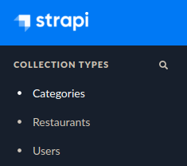


Có thể thấy, khi tạo thì chúng ta tạo Content-Type là `restaurant` dưới dạng là lowercase và số ít, tuy nhiên Strapi sẽ tự động xử lý cho chúng ta khi tạo xong, các mục chúng ta vừa tạo ở Content-Type Builder sẽ được chuyển thành dạng số nhiều ở mục **Collection Type** trên **sidebar**. Và danh từ số nhiều này cũng sẽ được sử dụng trong API.

Tiến hành tạo dữ liệu cho **Restaurants**

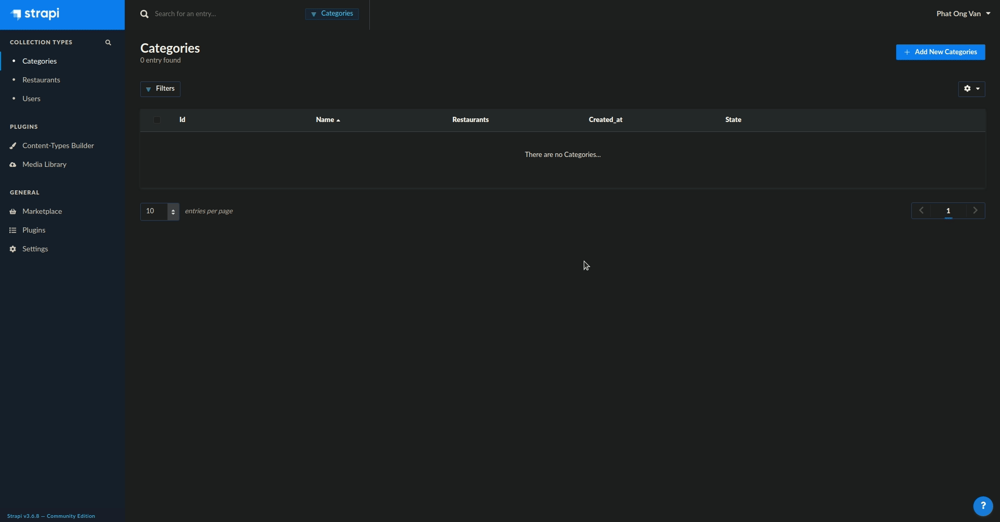

**Categories**

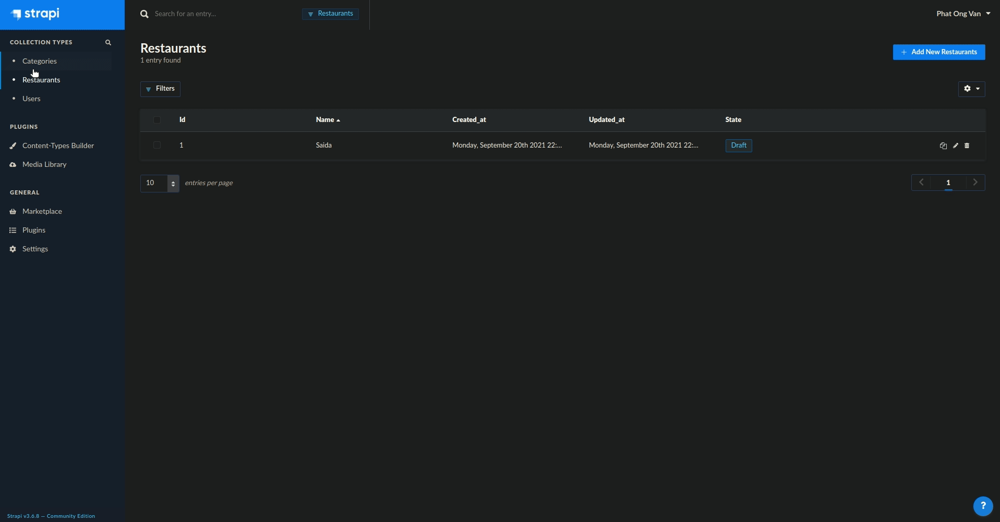

Như vậy là đã tạo xong dữ liệu, tiếp theo sẽ truy xuất dữ liệu thông qua API. Tuy nhiên, để đảm bảo việc truy xuất qua API chúng ta cần phải set permission cho API đó.

### Set Roles & Permission

Để set **Roles & Permission** cho API, làm theo các bước sau:

 1. Vào mục General -> Settings ở Sidebar
 2. Bên dưới mục `USER & PERMISSION PLUGIN`, chọn `Roles`
 3. Chọn Public
 4. Ở mục **Permission**, tiến hành chọn các quyền cho phép truy cập của APIs như CRUD.
 5. Chọn mục `count`, `findone`, `find` cho 2 bảng dữ liệu để đảm bảo có thể GET được dữ liệu ra thông qua API
 6. Bấm `Save` để tiến hành lưu.

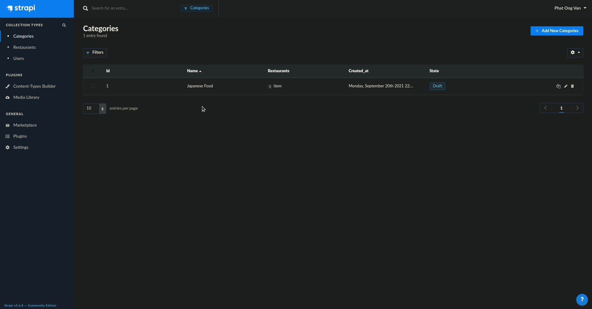

Như hình minh họa trên, khi bấm vào các mục role, chúng ta sẽ thấy được đường dẫn URL của API. Việc tiếp theo chúng ta cần phải **Publish** những nội dung đã tạo để có thể truy cập thông qua API

Để **Publish** các nội dung, chỉ cần vào các mục đã tạo và bấm **Publish**, các nội dung đã tạo sẽ chuyển đổi từ **Draft** sang **Published**

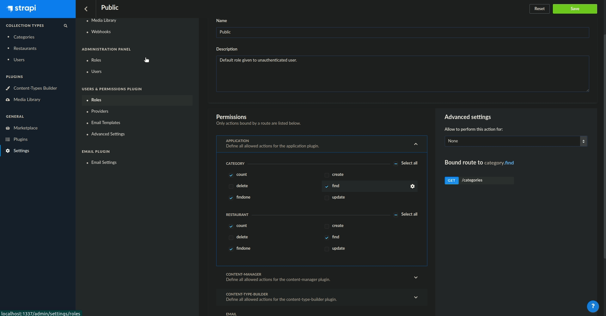

### Call API

Bây giờ có thể sử dụng API một cách bình thường rồi. Để call API, chúng ta sẽ sử dụng PostMan chạy thử API bên dưới xem sẽ lấy được dữ liệu gì.

API Restaurants

``http://localhost:1337/restaurants``

Và sau khi gọi API này, chúng ta sẽ lấy được dữ liệu như sau:

```json
[
    {
        "id": 1,
        "name": "Saida",
        "description": "Description about restaurant",
        "published_at": "2021-09-20T16:06:04.293Z",
        "created_at": "2021-09-20T15:47:51.289Z",
        "updated_at": "2021-09-20T16:06:04.303Z",
        "categories": [
            {
                "id": 1,
                "name": "Japanese Food",
                "published_at": "2021-09-20T16:05:55.462Z",
                "created_at": "2021-09-20T15:52:56.729Z",
                "updated_at": "2021-09-20T16:05:55.472Z"
            }
        ]
    }
]
```
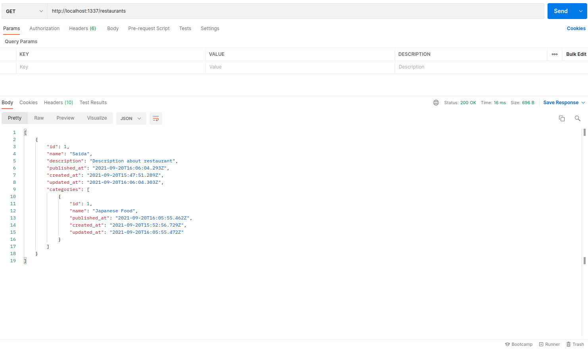

Như vậy là đã tạo thành công API trên Strapi hoàn chỉnh, dựa vào công cụ mạnh mẽ này, chúng ta có thể sử dụng để tạo ra những trang web với nhiều nội dung đa dạng chỉ trong thời gian ngắn mà không cần phải Code quá nhiều.

